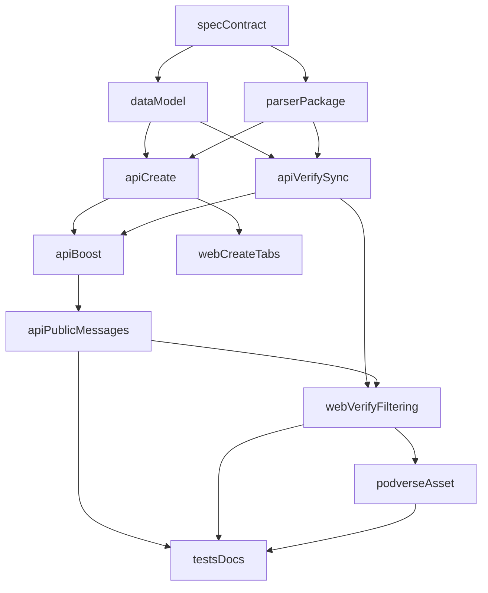

# MB1 RSS Rollout - Execution Order

## Goal

Implement mb1 RSS channel integration in Metaboost (API + web + shared packages) and add a
Podverse-hosted public RSS sample feed, using a custom minimal parser package.

## Constraints

- Do not modify this order unless dependency assumptions change.
- Complete phases sequentially.
- Run only the listed parallel groups in parallel.
- Keep management-api and management-web out of scope for this wave.
- No backwards compatibility in implementation phases: use hard replacements only.
- Removed/replaced routes or UI flows must be hard-removed with no redirect/fallback aliases.

## Phase Map

### Phase 0 - Contract lock (already completed)

1. Review canonical contract at `.llm/plans/completed/mb1-rss-rollout/01-MB1-SPEC-CONTRACT.md`
2. Ensure all active plan files remain aligned with:
   - MB1 standard prefixless path model + MetaBoost mapping under `/v1/s/mb1`
   - `action='boost'` vs `action='stream'` behavior (stream excluded from current message retrieval)

### Phase 1 - Data and parser foundations

1. `02-DATA-MODEL-AND-MIGRATIONS.md`
2. `03-MINIMAL-RSS-PARSER-PACKAGE.md`

Parallel notes:

- No parallel work in this phase.
- Parser contracts can be drafted while migration SQL is being refined, but final merge is
  sequential to avoid type drift.

### Phase 2 - API implementation

1. `04-API-BUCKET-CREATION-RSS-CHANNEL-GROUP.md`
2. `05-API-RSS-VERIFY-AND-SYNC-ITEM-BUCKETS.md`
3. `06-API-BOOST-MB1-INGEST-AND-CONFIRM.md`
4. `07-API-PUBLIC-MESSAGES-ENDPOINTS.md`

Parallel notes:

- Steps 1 and 2 are sequential because 5 depends on models introduced in 4.
- Steps 3 and 4 are sequential because 4 is capability metadata used by 3.

### Phase 3 - Web implementation

1. `08-WEB-BUCKET-CREATION-AND-RSS-TABS.md`
2. `09-WEB-RSS-VERIFICATION-AND-MESSAGE-FILTERING.md`

Parallel notes:

- Sequential; 9 depends on routes, tabs, and state from 8.

### Phase 4 - Cross-repo asset

1. `10-PODVERSE-PUBLIC-RSS-ASSET.md`

### Phase 5 - Validation and publication

1. `11-TESTS-AND-DOCS-CHECKLIST.md`
2. `12-TEST-FILE-MAPPING-AND-MATRIX.md`
3. `13-WEB-PUBLIC-HOW-TO-PAGES.md`

## Dependency Graph

## Completion Gate

Before marking this plan set complete:

- Contract review completed against `.llm/plans/completed/mb1-rss-rollout/01-MB1-SPEC-CONTRACT.md`.
- All numbered active plan files implemented in order.
- API integration tests updated for all new/changed endpoints.
- Web E2E specs updated for all new user-visible flows.
- mb1 docs and OpenAPI links updated to match runtime behavior.
- public how-to pages are live and accessible without authentication.
