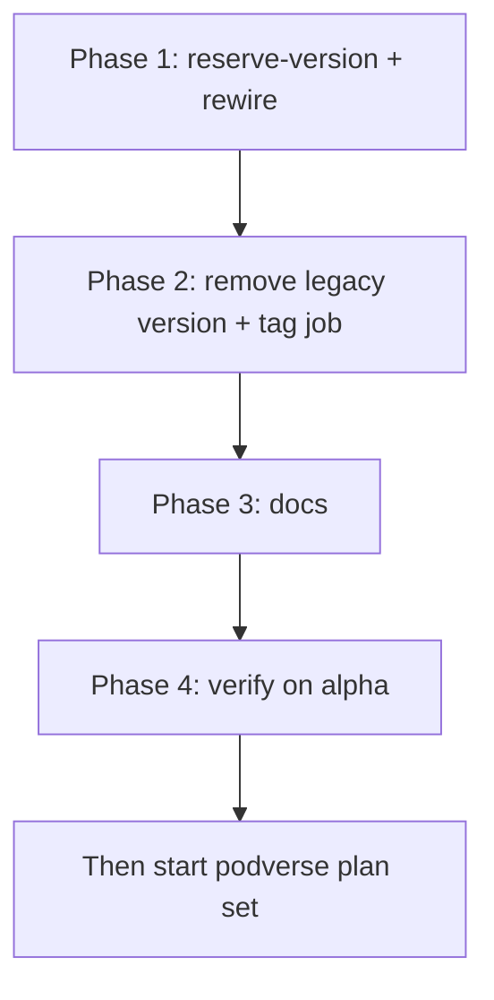

# Execution Order — Atomic Publish Version Reservation (metaboost)

This plan reworks `.github/workflows/publish-alpha.yml` so that the publish version
`X.Y.Z-{suffix}.N` is selected and reserved **atomically** via the GitHub Git Refs API
**before** any Docker image is pushed. GHCR is no longer the source of truth for the
next `N`; Git tags are.

All phases are **sequential**. Do not start phase N+1 until phase N is fully complete
and verified.

## Phase 1 — Add `reserve-version` and rewire downstream jobs

Single PR / branch. After this phase the workflow has both the new `reserve-version`
job and the old `validate` version-calculation step + `git-tag-staging` job (the old
ones are removed in Phase 2 to keep the diff reviewable).

1. `01-reserve-version-job.md` — Add the new `reserve-version` job between `validate`
   and `publish-docker`.
2. `02-rewire-needs-and-outputs.md` — Update every downstream job to depend on
   `reserve-version` and consume `needs.reserve-version.outputs.*`.

## Phase 2 — Remove the legacy version-calculation and tag job

3. `03-remove-git-tag-staging-and-validate-version.md` — Delete the `git-tag-staging`
   job and the `Calculate unified version` step from `validate`. Update remaining
   `needs:` lists.

## Phase 3 — Documentation

4. `04-docs-publish-update.md` — Update [docs/PUBLISH.md](../../../../docs/PUBLISH.md)
   to describe atomic reservation via Git ref API; clarify GHCR is image storage only.

## Phase 4 — Verify on a real run

5. `05-verification.md` — Push to `alpha`, walk through the verification checklist,
   and only then move on to the podverse plan set.

