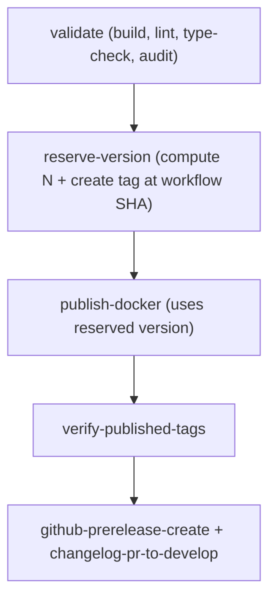

# Summary — Atomic Publish Version Reservation (metaboost)

## Why this keeps failing

Run [24852065873](https://github.com/podverse/metaboost/actions/runs/24852065873)
failed with `Refusing to move tag 0.1.9-staging.0` even after the previous "GHCR +
Git tags" combined-discovery change. That means the `Calculate unified version` step
in `validate` still picked `.0`, almost certainly because:

- `git ls-remote --tags origin "refs/tags/${BASE_VERSION}-${SUFFIX}.*"` returned
  nothing (errors are swallowed by trailing `|| true`), or
- the GHCR tag list was empty / `404` and we treated it as bootstrap.

Even when the increment **is** correct, the current ordering is unsafe:

- `publish-docker` pushes images first; `git-tag-staging` runs after and can fail.
  GHCR tags are mutable, so a duplicate `N` already overwrote images by the time the
  Git tag check rejects.
- Two concurrent runs can both compute the same `N` (race).

## Goal

A single, atomic source of truth for `N`: **the Git tag
`refs/tags/X.Y.Z-{suffix}.N`**, reserved before publish via
the GitHub Git Refs API (`POST /repos/{owner}/{repo}/git/refs`).

## Decisions

- **Git ref API is source of truth.** The GitHub `POST /repos/{owner}/{repo}/git/refs`
  endpoint is atomic: HTTP 201 = we won the race; HTTP 422 = "Reference already
  exists". For computed prerelease tags we bump `N` and retry; for exact-tag
  reservations (`version_override` and `main`) we resolve the existing tag and only
  accept 422 if it already points at `github.sha`.
- **GHCR is image storage only.** No more GHCR tag discovery for selecting `N`.
  Verification of pushed tags continues to use GHCR after the fact.
- **No silent failure in the authoritative reservation path.** All shell uses
  `set -euo pipefail`. Git Refs API failures other than 201/422 fail immediately;
  non-authoritative discovery fallbacks are explicit and logged.
- **Smart start hint, not source of truth.** `git ls-remote --tags` is only used to
  pick a starting `N` so we don't loop linearly from 0. If it fails or returns
  nothing, we still walk from 0; the create-ref race detection guarantees
  correctness.
- **Two-phase rollout in this workflow.** Phase 1 adds `reserve-version` and rewires
  consumers (the old version step still runs but is unused). Phase 2 deletes the
  legacy version step and the `git-tag-staging` job. This keeps the diff reviewable
  and lets us bail back to the old behaviour if Phase 1 misbehaves.

## Plan files

- `00-EXECUTION-ORDER.md`
- `00-SUMMARY.md` (this file)
- `01-reserve-version-job.md`
- `02-rewire-needs-and-outputs.md`
- `03-remove-git-tag-staging-and-validate-version.md`
- `04-docs-publish-update.md`
- `05-verification.md`
- `COPY-PASTA.md`

## Out of scope

- Podverse alignment lives in
  `podverse/.llm/plans/active/ci-atomic-version-reservation/`. Do not touch podverse
  until metaboost Phase 4 verification is green.
- `main` (RTM) tag handling stays as today (no suffix, single `X.Y.Z`).
