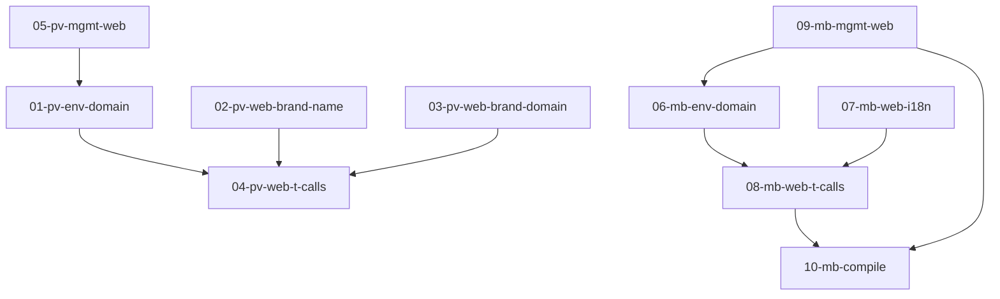

# i18n Brand Env Vars — Plan Set Summary

Created: 2026-04-21

## Problem

Both Podverse and Metaboost repos hardcode brand names ("Podverse", "Metaboost") and domains ("podverse.fm") directly in i18n translation strings. This prevents white-labeling — if someone deploys their own instance with a different brand name, every hardcoded reference would still show the original brand.

Both repos already have brand name env vars wired through runtime config (`NEXT_PUBLIC_BRAND_NAME` in Podverse, `NEXT_PUBLIC_WEB_BRAND_NAME`/`NEXT_PUBLIC_MANAGEMENT_WEB_BRAND_NAME` in Metaboost) and already use `{brand_name}` interpolation in *some* i18n strings. The gap is the remaining hardcoded references.

## Scope

### Podverse (2 apps, 8 locale files)

**Web app** (`apps/web`) — 4 locale files (en-US, es, fr, el-GR):
- 6 keys with hardcoded "Podverse" brand name
- 2 keys with hardcoded "podverse.fm" domain

**Management-web app** (`apps/management-web`) — 4 locale files:
- 2 keys with hardcoded "Podverse" brand name

New env var needed: `NEXT_PUBLIC_BRAND_DOMAIN` (for "podverse.fm")

### Metaboost (2 apps, 4+ locale files)

**Web app** (`apps/web`) — 2 locale files (en-US, es):
- 7 keys with hardcoded "Metaboost"/"MetaBoost"
- Dead `appTitle` key to remove

**Management-web app** (`apps/management-web`) — 2 locale files (en-US, es):
- 1 key with hardcoded "MetaBoost"
- Dead `appTitle` key to remove

New env var needed: `WEB_BRAND_DOMAIN` in classification base.yaml (for "metaboost.cc" — future-proofing, no hardcoded domain refs found yet)

## Plan Files

| File | Repo | Scope |
|------|------|-------|
| `01-podverse-env-brand-domain.md` | Podverse | Add `NEXT_PUBLIC_BRAND_DOMAIN` env var to sidecar, brand override, setup script, config |
| `02-podverse-web-i18n-brand-name.md` | Podverse | Replace "Podverse" with `{brand_name}` in web i18n originals (4 locales, 6 keys) |
| `03-podverse-web-i18n-brand-domain.md` | Podverse | Replace "podverse.fm" with `{brand_domain}` in web i18n originals (4 locales, 2 keys) |
| `04-podverse-web-t-call-sites.md` | Podverse | Wire `brand_name` and `brand_domain` into `t()` calls in web components |
| `05-podverse-mgmt-web-i18n.md` | Podverse | Replace "Podverse" with `{brand_name}` in management-web i18n (4 locales) + wire t() calls |
| `06-metaboost-env-brand-domain.md` | Metaboost | Add `WEB_BRAND_DOMAIN` to classification base.yaml, runtime config, config helpers |
| `07-metaboost-web-i18n.md` | Metaboost | Replace "Metaboost" with `{brand_name}` in web i18n originals (2 locales, 7 keys) + remove appTitle |
| `08-metaboost-web-t-call-sites.md` | Metaboost | Wire `brand_name` into `t()` calls in web components |
| `09-metaboost-mgmt-web-i18n.md` | Metaboost | Replace "MetaBoost" with `{brand_name}` in management-web i18n (2 locales) + remove appTitle + wire t() calls |
| `10-metaboost-i18n-compile.md` | Metaboost | Run `npm run i18n:sync`, `npm run i18n:compile`, `npm run i18n:validate` |

## Dependency Graph

## Decisions

- Use `{brand_name}` as the interpolation variable name (matches existing Podverse pattern)
- Use `{brand_domain}` as the interpolation variable name for domain references
- `appTitle` i18n keys in Metaboost are dead code — remove them rather than convert
- Domain env vars are added even though Metaboost has no hardcoded domain refs yet — future-proofing
- Non-English locales will have `{brand_name}` / `{brand_domain}` placeholders inserted; the brand name/domain is the same across all locales (it's a proper noun/URL), so no translation is needed for the interpolated values themselves
