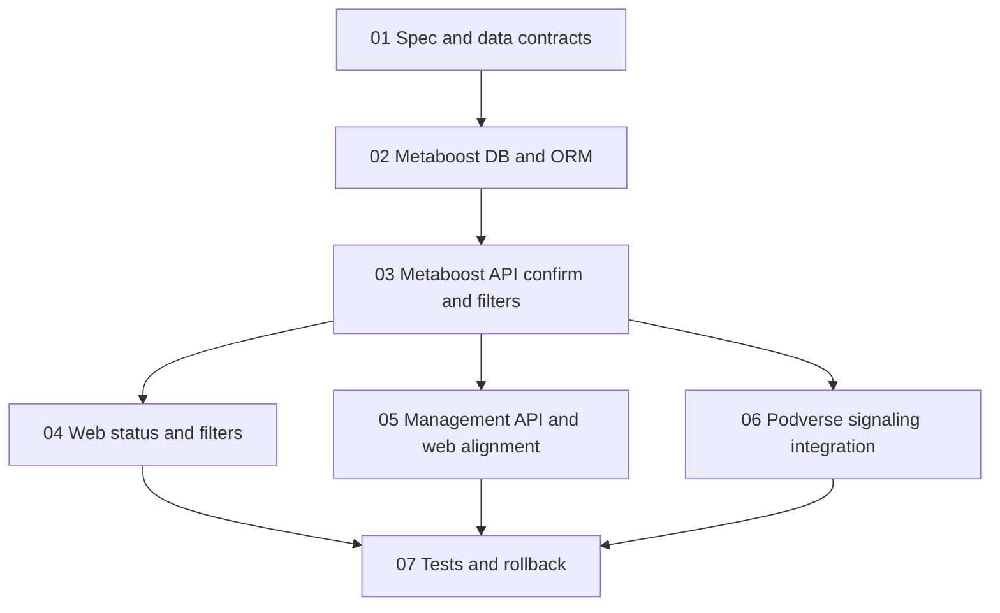

# Execution Order

## Phase 1 - Contract baseline (sequential)

1. Complete `01-SPEC-AND-DATA-CONTRACTS.md`.

Exit criteria:

- Verification levels and transition rules are documented and approved.
- Confirm-payment request/response contracts are frozen.
- Filter/query parameter semantics are frozen.

## Phase 2 - Metaboost persistence + API (sequential)

1. Complete `02-METABOOST-DB-AND-ORM.md`.
2. Complete `03-METABOOST-API-CONFIRM-PAYMENT-AND-FILTERS.md`.

Exit criteria:

- DB schema and ORM support level-aware verification and recipient outcomes.
- API can ingest recipient outcomes and calculate/store level.
- List endpoints apply threshold and include flags correctly.

## Phase 3 - Parallel implementation tracks

Start these in parallel only after Phase 2 is complete:

- Track A: `04-METABOOST-WEB-STATUS-ICONS-FILTERS-EXPAND.md`
- Track B: `05-METABOOST-MANAGEMENT-API-WEB-ALIGNMENT.md`
- Track C: `06-PODVERSE-INTEGRATION-AND-SIGNALING.md`

Exit criteria:

- Web and management-web render correct status icons and details.
- New filter controls align with threshold semantics.
- Podverse posts confirm-payment payloads with recipient outcomes.

## Phase 4 - Verification and rollout hardening (sequential)

1. Complete `07-TESTS-AND-ROLLBACK.md`.

Exit criteria:

- API integration tests and E2E coverage pass for new behavior.
- Cross-repo compatibility risks are documented with rollback steps.

## Dependency graph

