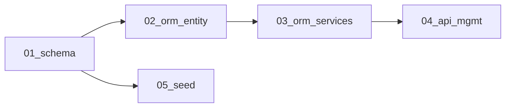

# Membership rename plan set

Hard-break rename of `user_trust_settings` → `user_membership` and `UserTrustSettings` → `UserMembership` across schema, ORM, APIs, seeds, and E2E tooling. No fallbacks or legacy names.

## Recorded decisions

| Decision | Choice |
|----------|--------|
| Table / entity | `user_membership` / `UserMembership` (single 1:1 table, inline `membership_tier`) |
| Podverse mirror | Naming domain only (membership); **not** the two-table split (`account_membership` + `account_membership_status`) |
| Scope | Table, entity, relation, and code usages only |
| Out of scope | `packages/helpers/src/trust/` (entitlement capability keys + membership constants); management-web `trustTier*` i18n keys |
| Migration style | Edit original `CREATE TABLE` in `0003`; fold `0004` ALTER columns into `0003`; rename migration files; regenerate `0003a` baseline |

## Plan files

| File | Topic |
|------|--------|
| [01-schema-migrations.md](01-schema-migrations.md) | Linear SQL, kustomization, baseline regen |
| [02-orm-entity-and-relations.md](02-orm-entity-and-relations.md) | Entity, User relation, exports |
| [03-orm-services.md](03-orm-services.md) | UserService, renewal orchestrator, period extension |
| [04-api-and-management-usages.md](04-api-and-management-usages.md) | requireAuth, billing, management users |
| [05-seed-and-e2e-tooling.md](05-seed-and-e2e-tooling.md) | Local dev seed + E2E seed script |

## Dependency map

## Integrates

- Local dev login fix: `localdev` gets `user_membership` row (premium, long expiry) in [0008_seed_local_user.sql](../../../infra/k8s/base/db/source/bootstrap/0008_seed_local_user.sql).

## Status

Implemented on branch; operator must re-init local DB or run one-off insert for existing Docker volumes.
