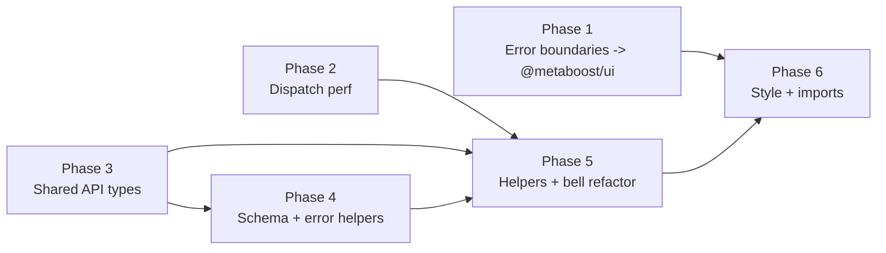

# 00 - Summary - Metaboost staged-changes cleanup

## Scope

Clean up DRY violations and inefficiencies introduced by the bucket-webpush-foundation
changeset and a few adjacent additions. The cleanup is dependency-ordered into six
phases that can each ship as a focused PR. Phase 1 has the largest line-count impact
(removes ~250 lines of duplicate error-boundary code). Phases 2-3 fix correctness and
scaling issues (N+1 dispatch, per-row descendant upsert, drifted API/client types).
Phases 4-6 are smaller dedup and hygiene passes.

## Plan files

- [01-error-boundaries-shared-ui.md](./01-error-boundaries-shared-ui.md) - Move
  duplicated `error.tsx` / `global-error.tsx` into `@metaboost/ui` components.
- [02-notification-dispatch-perf.md](./02-notification-dispatch-perf.md) - Fix N+1 and
  serial sends in webpush channel; bulk-upsert descendant notification preferences.
- [03-shared-api-contract-types.md](./03-shared-api-contract-types.md) - Move
  webpush + notification-preference TS types to `@metaboost/helpers-requests` so the
  API and client share one declaration.
- [04-schema-and-error-helpers.md](./04-schema-and-error-helpers.md) - Extract
  `WebPushSubscriptionKeys` in OpenAPI + Joi; add `isPgUniqueViolation` helper in
  `@metaboost/orm`; add web-push status-code helper.
- [05-helpers-and-bell-refactor.md](./05-helpers-and-bell-refactor.md) - Auth
  boilerplate helper, cookie helper, server-fetch helper, single-query upserts,
  split `BucketNotificationsBell` into hook + modal hook + presentational.
- [06-style-and-import-hygiene.md](./06-style-and-import-hygiene.md) - Inline
  styles to SCSS modules, web-push named imports, logger alignment.

## Dependency map

Phase 1 is independent (UI tree). Phase 2 is independent (server only). Phase 3
unblocks the schema and helper phases (they import canonical types). Phase 5 depends
on Phases 3 and 4. Phase 6 is the last polish pass.

## Key decisions

- Error-boundary shape: move to `@metaboost/ui` rather than an internal shared module,
  per `reusable-components` and `ui-component-promotion` skills (user choice).
- Auth narrowing: add a `requireUser(req, res)` helper rather than a typed
  `AuthenticatedRequest`, to keep the change local and avoid a request-type rewrite.
- Push send fan-out: use `Promise.allSettled` (not `Promise.all`) so one bad
  endpoint cannot abort the whole batch.
- Postgres errors: a single shared `isPgUniqueViolation` helper in `@metaboost/orm`
  replaces both inline guards and removes two `as` assertions flagged by
  `avoid-type-assertions`.
- Out of scope: a sweep of pre-existing duplication elsewhere in
  `helpers-requests/web/buckets.ts` and the auth-boilerplate pattern in controllers
  not touched by the staged changes.

## Verification

End each phase with the make targets in that phase's plan file. After Phase 1 and
Phase 6 (the only UI-visible changes), the response must end with the corresponding
`make e2e_test_*_report_spec` block per the `end-with-targeted-make-report-verify`
rule.
