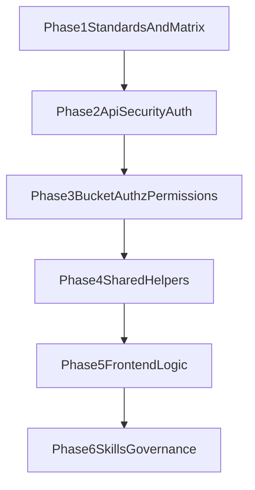

# Metaboost Unit Tests - Confident Coverage

## Goal

Raise unit-test confidence for critical logic in Metaboost while avoiding excessive granularity and maintenance-heavy test matrices.

## Scope Priorities

1. Security-sensitive API auth/assertion logic.
2. Authorization and bucket permission policy decisions.
3. Reused helper logic with high blast radius.
4. Selective frontend logic modules where E2E coverage is not enough.
5. Agent skills that keep this strategy consistent on future work.

## Plan Files

- `01-testing-standard-and-target-matrix.md`
- `02-api-security-auth-units.md`
- `03-bucket-authz-and-permissions-units.md`
- `04-shared-helpers-unit-expansion.md`
- `05-selective-frontend-logic-units.md`
- `06-skills-and-governance-updates.md`

## Confidence Definition

"Confident" means:

- Every high-risk branch and failure mode in critical logic has at least one direct unit assertion.
- Tests focus on behavior and invariants, not implementation details.
- We cover meaningful boundary conditions and representative negative cases.
- We explicitly skip exhaustive combinatorial permutations that provide low marginal value.

## Coverage Flow

## Key Decisions

- Prefer pure-function and module-level tests first; add component tests only for logic that cannot be sufficiently validated in utility tests.
- Keep test fixtures minimal and explicit.
- Favor deterministic mocks/stubs for time, randomness, and external state boundaries.
