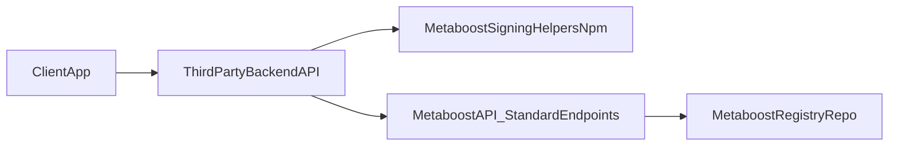

# Standard Endpoint Signing Rollout - Summary (NPM Helpers)

> **Status:** Plan set **complete.** Location: `.llm/plans/completed/s-endpoint-signing-rollout/`.

## Objective

Deliver a complete cross-repo rollout plan for Standard Endpoint app signing that:

- makes `metaboost-registry` the default public-key source for Metaboost verification;
- introduces a reusable npm helper package for third-party backend APIs;
- provides clear developer onboarding from app registration to successful signed requests;
- enforces HTTPS outside local development with ingress and app-level controls.

## Repositories In Scope

- [`/Users/mitcheldowney/repos/pv/metaboost`](file:///Users/mitcheldowney/repos/pv/metaboost)
- [`/Users/mitcheldowney/repos/pv/metaboost-registry`](file:///Users/mitcheldowney/repos/pv/metaboost-registry)
- [`/Users/mitcheldowney/repos/pv/podverse`](file:///Users/mitcheldowney/repos/pv/podverse) (plan **12** — AppAssertion integration for mbrss-v1)

## Out-of-Scope

- Running implementation commands in this plan-only pass.
- Building or deploying a standalone signing API container/service.
- Podverse runtime/Ansible rollout for hosting a dedicated signing service.

## Architecture Map

## Deliverables

- Control files: `00-SUMMARY.md`, `00-EXECUTION-ORDER.md`, `COPY-PASTA.md` (all under `.llm/plans/completed/s-endpoint-signing-rollout/`).
- Decision gate file: `00A-DECISION-LOCKS.md`.
- Numbered execution plans:
  - `01-registry-repo-foundation.md`
  - `02-registry-contributor-and-ops-docs.md`
  - `03-signing-helpers-package-scaffold.md` (completed under `.llm/plans/completed/s-endpoint-signing-rollout/`)
  - `04-signing-helpers-package-release-and-distribution.md` (completed under `.llm/plans/completed/s-endpoint-signing-rollout/`)
  - `05-metaboost-registry-default-config.md` (completed under `.llm/plans/completed/s-endpoint-signing-rollout/`)
  - `06-metaboost-s-endpoint-appassertion-verification.md` (completed under `.llm/plans/completed/s-endpoint-signing-rollout/`)
  - `07-metaboost-https-enforcement.md` (completed under `.llm/plans/completed/s-endpoint-signing-rollout/`)
  - `08-developer-end-to-end-guides-helpers.md` (completed under `.llm/plans/completed/s-endpoint-signing-rollout/`)
  - `09-consumer-integration-examples.md` (completed under `.llm/plans/completed/s-endpoint-signing-rollout/`)
  - `10-npm-publish-verification-gate.md` (completed under `.llm/plans/completed/s-endpoint-signing-rollout/`)
  - `12-podverse-standard-endpoint-signing-integration.md` (completed under `.llm/plans/completed/s-endpoint-signing-rollout/`; Podverse monorepo; **depended on 10**)
  - `11-cross-repo-rollout-validation.md` (completed under `.llm/plans/completed/s-endpoint-signing-rollout/` — runbook + post-rollout report template)

## Dependency Map

- Decision locks (`00A`) must be completed before any implementation phase begins.
- Registry structure and docs (`01`, `02`) must be stable before registry consumption code and onboarding docs (`05`, `06`, `08`, `09`).
- Helper package scaffold (`03`) must precede package distribution and release strategy (`04`).
- Metaboost verification (`06`) depends on registry defaults (`05`) and is secured by HTTPS policy (`07`).
- Consumer integration docs/examples (`08`, `09`) depend on stable helper APIs from `03` and `04`.
- Gate **10** is complete (published `metaboost-signing` on npm; minimum semver **0.2.1** recorded in [COPY-PASTA.md](./COPY-PASTA.md) Phase 5; plan file [`10-npm-publish-verification-gate.md`](./10-npm-publish-verification-gate.md)).
- Podverse (**12**) is complete: signed mbrss-v1 ingest via Podverse API mint + web client (see completed plan **12**).
- Rollout validation (`11`) is complete: [STANDARD-ENDPOINT-ROLLOUT-RUNBOOK.md](../../../../docs/api/STANDARD-ENDPOINT-ROLLOUT-RUNBOOK.md) and [STANDARD-ENDPOINT-POST-ROLLOUT-VALIDATION-REPORT-TEMPLATE.md](../../../../docs/api/STANDARD-ENDPOINT-POST-ROLLOUT-VALIDATION-REPORT-TEMPLATE.md). Podverse integration work was scoped in **12**, not **11**.

## Key Decisions Captured

- Default registry URL in Metaboost points to Podverse Metaboost Registry repo.
- Registry source must be overridable via environment variable.
- Metaboost Registry PRs must pass GitHub Actions validation before merge (required status check).
- HTTPS policy is defense-in-depth:
  - ingress TLS is required in non-local environments;
  - app-level HTTPS enforcement rejects insecure non-local requests.
- Third-party integration uses npm helpers inside existing backend APIs, not a hosted signing service.

## Risks To Manage During Implementation

- Breaking existing unsigned `/v1/standard/*` POST clients when verification enforcement ships.
- Mismatch between helper package output and Metaboost verifier contract.
- Proxy/TLS misconfiguration causing false HTTPS rejections.
