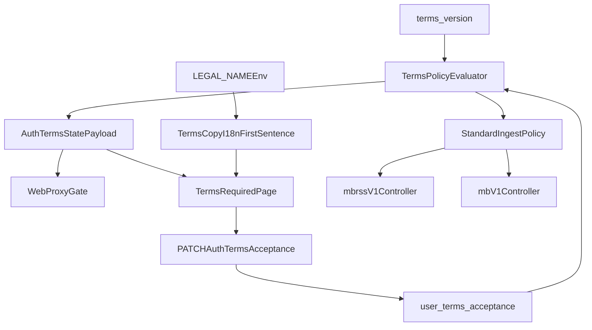

# Terms Grace Clean-Slate Summary

## Goal

Implement a day-one, DB-native Terms of Service policy model that supports:

- scheduled announcement windows
- grace period acceptance
- hard enforcement date
- versioned user acceptance history
- shared policy behavior across auth gating and bucket message ingest

## Plan Files

- `00-EXECUTION-ORDER.md`
- `01-schema-and-orm.md`
- `02-policy-evaluator-and-auth-api.md`
- `03-web-gating-and-ux.md`
- `04-standard-endpoint-enforcement.md`
- `05-openapi-tests-and-seeds.md`
- `06-operations-and-legal-name-i18n.md`
- `COPY-PASTA.md`

## Core Design Decisions

- Source of truth moves from env date fields to DB-backed `terms_version`.
- User acceptance is versioned (`user_terms_acceptance` -> `terms_version_id`) instead of latest-only.
- A single policy evaluator computes `phase` and `mustAcceptNow` for all call sites.
- Enforced phase blocks app continuation and bucket receive for non-accepted owners.
- Terms URL is the authority for terms content in effect; bucket checks do not need owner/policy
  metadata fields in success responses.
- Terms URL strategy: use one stable public URL (`/terms`) that dynamically renders the active
  terms version from DB; clients do not need version-specific URLs.
- Bucket GET/POST checks return clear blocker error messages when terms acceptance is required.
- Bucket GET blocker and POST blocker use explicit, stable error contracts (status code + code +
  message), documented in OpenAPI and mirrored in tests.
- Include an operator lifecycle path for creating/scheduling/activating terms versions (no ad-hoc
  DB updates in production without runbook/API support).
- Add `LEGAL_NAME` as a first-class env variable, propagated through template contract/overrides and
  runtime config so i18n terms copy can render a generic first sentence authored by the site owner.

## Data and Flow Overview

## Verification Philosophy

- API changes require integration tests covering all policy phases.
- Web gating changes require E2E coverage for redirect, acceptance, and delete fallback.
- OpenAPI and response contracts are updated in lockstep with behavior.
