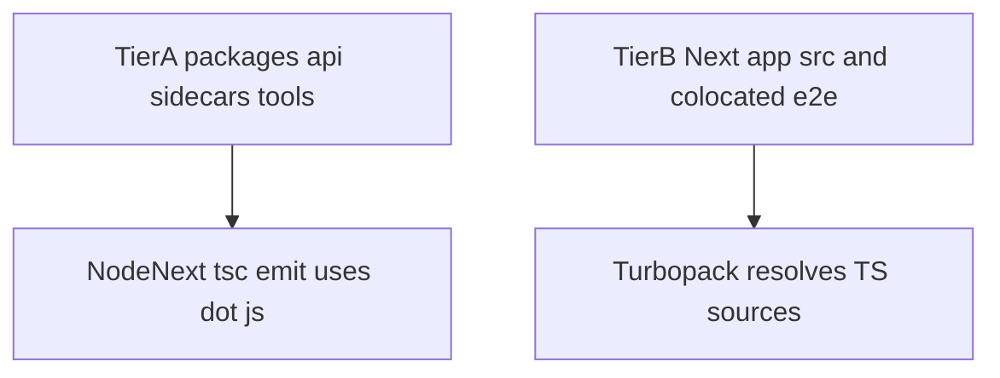

# Tiered import specifiers — summary

## Problem

TypeScript with **`moduleResolution: NodeNext`** expects **relative import specifiers** to use a **`.js` extension** when they refer to emitted JS next to sources. That matches **`tsc` output** and Node’s ESM loader for **packages** and **Node apps**.

**Next.js** (`next build` with **Turbopack**) often **does not** resolve `./Foo.js` to `Foo.tsx` on disk (parity gap vs webpack’s `resolve.extensionAlias`). See [vercel/next.js#82945](https://github.com/vercel/next.js/issues/82945).

## Strategy (two tiers)

| Tier | Scope | Relative imports |
| ---- | ----- | ---------------- |
| **A** | `packages/*`, `apps/api`, `apps/management-api`, `apps/*/sidecar`, `tools/**` | Prefer **`.js` specifiers** (NodeNext); enforce via ESLint where configured. |
| **B** | `apps/web/src/**`, `apps/management-web/src/**`; Playwright `e2e/**` under those apps | **Extension-flexible** (prefer **extensionless** until Turbopack supports `.js`→`.tsx`); ESLint **does not** require `.js` here. |

## Outcomes

1. **Documented** split ([`docs/development/tooling/DOCS-DEVELOPMENT-TOOLING-IMPORT-SPECIFIERS.md`](/docs/development/tooling/DOCS-DEVELOPMENT-TOOLING-IMPORT-SPECIFIERS.md)).
2. **ESLint** enforces Tier A; Tier B overridden off for import extensions.
3. **Sweep** Tier A (`04-monorepo-sweep-matrix.md`).
4. **Future:** converge Tier B when upstream fixes land (`06-future-convergence-todo.md`).

## Repo

Metaboost monorepo (`@metaboost/*`). Podverse has the same plan under `.llm/plans/active/tiered-import-specifiers-node-vs-next/` with `@podverse/*` paths.
