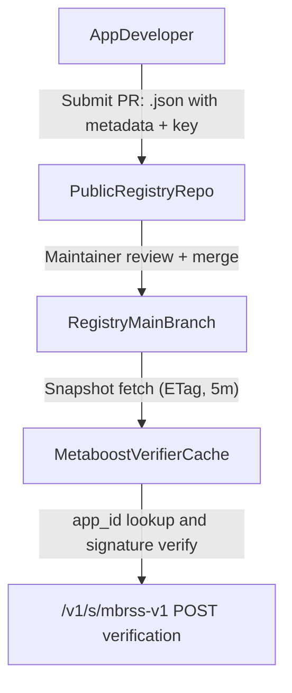
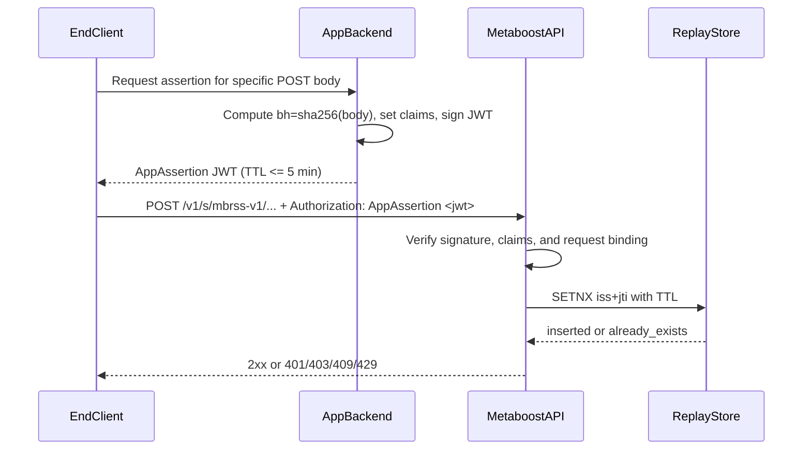
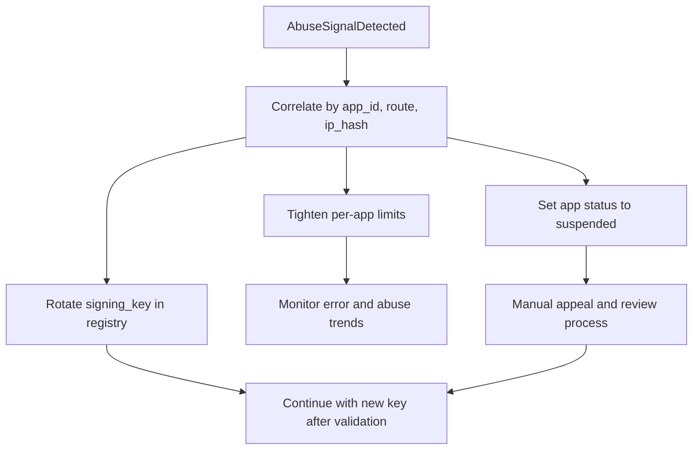

# `/s/` endpoint app-signing proposal

This document proposes the simplest reliable way to keep `/s/` write endpoints publicly callable
while making every accepted write request attributable to a registered app identity.

Current context:

- `/s` routes are public and CORS-permissive in `apps/api/src/app.ts`.
- mbrss-v1 write routes are in `apps/api/src/routes/mbrssV1.ts`.
- Existing controls are schema and business validation, but not caller identity proof.

## Summary of the approach

Use a public GitHub-backed app key registry plus short-lived signed app assertions:

- Every app registers public keys and minimal metadata in a public registry repository.
- For each POST request, the app backend mints a short-lived JWT assertion signed by its private
  key.
- Metaboost verifies signature, app status, request binding claims, and replay nonce before
  processing the write.
- Metaboost can instantly suspend apps, rotate keys, and apply per-app throttling.

This allows requests to originate from browser, mobile, or server, but keeps private keys on app
backends.

## Goals

- Attribute every accepted `/s` write request to a known `app_id`.
- Keep the integration path practical for third-party apps.
- Provide deterministic controls to throttle, suspend, and revoke abusive senders.
- Use one final day-1 model instead of phased migration.

## Non-goals

- This does not prove the identity of end users of an app.
- This does not eliminate Sybil risk (new app registrations are still possible).
- This is not a replacement for content validation or anti-spam heuristics.

## Threat model

Primary threats addressed:

- Anonymous scripted spam to public write endpoints.
- Replay of previously valid requests.
- Abuse concentration behind shared IP ranges.
- Key compromise where a single app key must be disabled quickly.

Not fully solved by this design:

- A fully compromised registered app backend can still submit abusive traffic until suspended.
- Malicious app operators can register and later abuse if review is weak.

## Protocol: signed requests for `/s` POST endpoints

### Transport

- Header: `Authorization: AppAssertion <jwt>`
- Content-Type: `application/json`
- Endpoint scope (day 1): all `POST` routes under `/v1/s/*`

### JWT header requirements

- `alg`: `EdDSA` (Ed25519)
- `typ`: `JWT`

### JWT claim requirements

- `iss` (string): registered `app_id`
- `iat` (number): issued-at epoch seconds
- `exp` (number): expiration epoch seconds, max TTL 300 seconds
- `jti` (string): unique nonce (UUID v4 recommended)
- `m` (string): uppercase HTTP method (`POST`)
- `p` (string): exact request path, including API version prefix
- `bh` (string): lowercase hex SHA-256 of raw JSON body bytes

Optional claims:

- `app_ver` (string): app version for diagnostics

### Request binding and canonicalization

Metaboost recomputes and compares:

1. `m` against actual HTTP method.
2. `p` against actual request path.
3. `bh` against SHA-256 of exact request body bytes.

If any binding check fails, reject before controller logic.

### Replay protection

- Store `jti` keyed by `iss + jti` with TTL until `exp + clockSkew`.
- Reject reuse as replay.
- Recommended clock skew allowance: 60 seconds.

### Verification outcomes

| Status | Error code                     | Meaning                                      |
| ------ | ------------------------------ | -------------------------------------------- |
| 401    | `app_assertion_missing`        | Header absent or malformed                   |
| 401    | `app_assertion_invalid`        | Signature invalid, claim missing, or expired |
| 401    | `app_assertion_binding_failed` | `m` / `p` / `bh` mismatch                    |
| 403    | `app_not_registered`           | `iss` not found in active registry           |
| 403    | `app_suspended`                | App is suspended or revoked                  |
| 409    | `app_assertion_replay`         | `jti` already used                           |
| 429    | `app_rate_limited`             | Per-app or per-app+IP throttle exceeded      |

Response body shape:

```json
{
  "message": "Request signature verification failed.",
  "errorCode": "app_assertion_invalid"
}
```

## Public registry model (GitHub, manual approval)

## Registry repository

Create a dedicated public repository (example name: `metaboost-app-registry`) with PR approval.

Proposed structure:

```text
registry/
  apps/
    <app_id>.json
```

### `<app_id>.json` minimum fields

- `app_id` (string, stable slug)
- `display_name` (string)
- `owner` object:
  - `organization` (string)
  - `contact_email` (string)
  - `contact_url` (string, optional)
- `status` (`active` | `suspended` | `revoked`)
- `created_at` (ISO datetime)
- `updated_at` (ISO datetime)
- `signing_key` object:
  - `kty` (`OKP`)
  - `crv` (`Ed25519`)
  - `x` (public key)
  - `alg` (`EdDSA`)
  - `updated_at` (ISO datetime)

## Registry ingestion by Metaboost

- Poll registry snapshot every 5 minutes with ETag support.
- Keep last-known-good snapshot in memory and on disk.
- On fetch failure, continue verifying with last-known-good snapshot.
- If no snapshot has ever been loaded, fail closed for signed writes.

## Operational controls

### Rate limiting

Apply layered limits on signed write routes:

- Global per-IP ceiling (coarse abuse containment).
- Per-`app_id` budget.
- Per-`app_id + IP` budget.

This keeps one app from exhausting global capacity and limits hot-spot abuse behind NATs.

### Attribution and audit

For every write attempt, log:

- `app_id`, `jti`, decision (`accepted` / reject reason), route, IP hash, user agent.

Store enough retention to support abuse investigations and registry enforcement decisions.

### Revocation actions

- Suspend app: set `status=suspended` to block all writes from that app.
- Revoke app: set `status=revoked` for permanent block.
- Rotate key: update `signing_key` in `<app_id>.json`.
- Restore app by status change after review.

All actions are audit-logged and take effect on next registry poll (or manual refresh endpoint).

## Day-1 deployment policy

- Signature verification is required for every `POST /v1/s/*` request from day 1.
- Unsigned write requests are rejected.
- Every registered app has the same permissions on `/s` write endpoints.
- Abuse handling is operational (rate-limit, suspend key, suspend app) on day 1.

## Why this is the simplest reliable option

- More attributable and revocable than static shared API keys.
- Practical for browser/mobile call origins by moving signing responsibility to app backends.
- Uses only one integration path for all apps: register key, sign request, call `/s`.

## Simplicity-first design choices

- No phased rollout.
- No per-app scopes.
- No advanced standards dependency required for adoption.
- Minimal required claims and metadata only.

## Process diagrams







## Implementation notes for follow-up

- Add middleware in `apps/api` before mbrss-v1 POST handlers to verify app assertions.
- Add a registry loader and cache module with strict schema validation.
- Extend rate limiting middleware to include signed-route app-aware strategies.
- Document onboarding steps for third-party developers and key rotation runbook.
