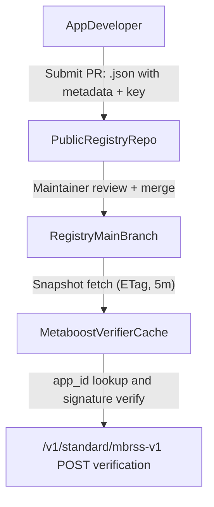
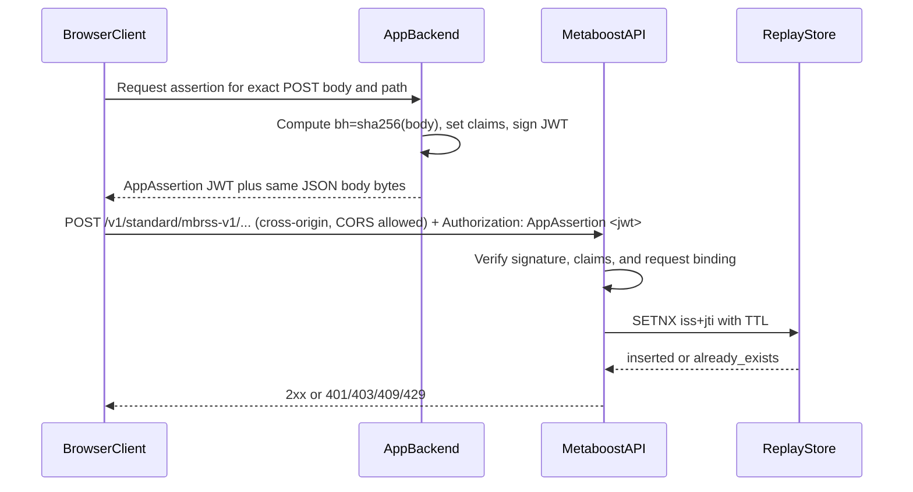
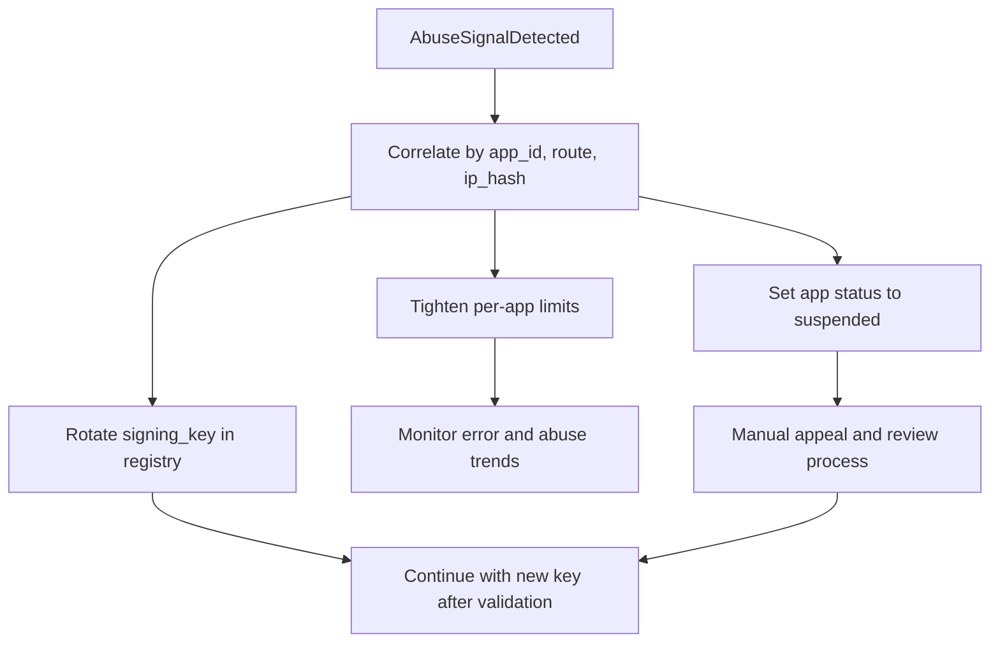

# Standard Endpoint (`/standard/`) app-signing proposal

This document proposes the simplest reliable way to keep `/standard/` write endpoints publicly callable
while making every accepted write request attributable to a registered app identity.

Current context:

- `/standard` routes are public and **CORS-permissive for browser clients** (see [CORS policy (settled)](#cors-policy-settled)).
- mbrss-v1 write routes are in `apps/api/src/routes/mbrssV1.ts`.
- Existing controls are schema and business validation, but not caller identity proof.

## Summary of the approach

Use a public GitHub-backed app key registry plus short-lived signed app assertions:

- Every app registers public keys and minimal metadata in a public registry repository.
- For each POST request, the app backend mints a short-lived JWT assertion signed by its private
  key.
- Metaboost verifies signature, app status, request binding claims, and replay nonce before
  processing the write.
- Metaboost can instantly suspend apps, rotate keys, and apply per-app throttling.

This allows requests to originate from browser, mobile, or server, but keeps private keys on app
backends.

## CORS policy (settled)

MetaBoost intentionally exposes **`/standard` write APIs to cross-origin browser requests** from **arbitrary
web app origins** (permissive CORS in `apps/api/src/app.ts`, e.g. reflecting allowed origins or
otherwise allowing third-party sites to call the API from JavaScript). That is a **product
constraint**, not a mistake:

- Podcast apps run on many different domains; each feed can advertise a **different** MetaBoost
  base URL (`metaBoost.node`). Browsers must be able to `POST` the JSON body **directly** to that
  MetaBoost deployment **without** every app shipping a same-origin reverse proxy.
- **Authorization must not rely on `Origin`.** Any website can cause a **user’s browser** to send
  requests to MetaBoost if the user visits a malicious page; the real controls are **TLS**,
  **AppAssertion signature verification**, the **public key registry**, replay protection, and rate
  limits—not CORS as an allowlist of “trusted sites.”

So: **open / universal CORS for MetaBoost** is compatible with this design because **registered app
identity is proven by the signed JWT**, not by the browser’s origin header.

## Signing placement: app backend mints, front end sends to MetaBoost

The **private signing key never ships to the browser.** Recommended end-to-end flow for web apps:

1. **App backend** (holds the registry-registered private key) receives whatever trigger is needed
   from the client (e.g. “prepare mbrss-v1 POST for this canonical JSON body and ingest URL”).
2. **App backend** computes request binding per this spec (`bh` = SHA-256 of the **exact** raw JSON
   bytes to be sent), builds the short-lived `AppAssertion` JWT, and returns it to the client
   together with the **same** JSON body (or a contract that the client will not mutate bytes before
   send).
3. **Front end** (browser or embedded WebView) calls **MetaBoost directly**:
   `POST` to the feed’s mbrss-v1 ingest URL with `Content-Type: application/json`, body bytes
   identical to what was hashed for `bh`, and `Authorization: AppAssertion <jwt>`.
4. **MetaBoost** verifies the assertion, registry, binding, and replay store; then runs the
   handler.

Why this shape:

- **SSRF:** A consumer app’s **API** must not become an open “forward POST to any user-supplied
  URL” service. Having the **browser** open the HTTPS connection to the podcaster’s MetaBoost host
  avoids that class of server-side abuse while still allowing arbitrary RSS-advertised endpoints.
- **Key safety:** Only the app operator’s **servers** see the private key; the client only handles
  the **already-signed** assertion and opaque body.

Native apps can use the same pattern (backend mints assertion; app sends POST) or call MetaBoost
from a trusted daemon; the critical requirement remains **sign with a server-held key**, **verify
on MetaBoost**.

## Goals

- Attribute every accepted `/standard` write request to a known `app_id`.
- Keep the integration path practical for third-party apps.
- Provide deterministic controls to throttle, suspend, and revoke abusive senders.
- Use one final day-1 model instead of phased migration.

## Non-goals

- This does not prove the identity of end users of an app.
- This does not eliminate Sybil risk (new app registrations are still possible).
- This is not a replacement for content validation or anti-spam heuristics.

## npm helper package

Third-party backends can install **`metaboost-signing`** from the **public npm registry** (no GitHub auth for consumers). Install, semver policy, Node requirements, and maintainer release steps are documented in [METABOOST-SIGNING-DISTRIBUTION.md](./METABOOST-SIGNING-DISTRIBUTION.md).

End-to-end onboarding (registry PR, backend install, signing, troubleshooting): [METABOOST-APP-INTEGRATOR-QUICKSTART.md](./METABOOST-APP-INTEGRATOR-QUICKSTART.md) (linear quick start); [STANDARD-ENDPOINT-INTEGRATION-GUIDE.md](./STANDARD-ENDPOINT-INTEGRATION-GUIDE.md) (npm-focused detail).

Backend patterns and copy-paste examples: [STANDARD-ENDPOINT-CONSUMER-EXAMPLES.md](./STANDARD-ENDPOINT-CONSUMER-EXAMPLES.md).

## Threat model

Primary threats addressed:

- Anonymous scripted spam to public write endpoints.
- Replay of previously valid requests.
- Abuse concentration behind shared IP ranges.
- Key compromise where a single app key must be disabled quickly.

Not fully solved by this design:

- A fully compromised registered app backend can still submit abusive traffic until suspended.
- Malicious app operators can register and later abuse if review is weak.

## Protocol: signed requests for `/standard` POST endpoints

### Transport

- Header: `Authorization: AppAssertion <jwt>`
- Content-Type: `application/json`
- Endpoint scope (day 1): all `POST` routes under `/v1/standard/*`

### JWT header requirements

- `alg`: `EdDSA` (Ed25519)
- `typ`: `JWT`

### JWT claim requirements

- `iss` (string): registered `app_id`
- `iat` (number): issued-at epoch seconds
- `exp` (number): expiration epoch seconds, max TTL 300 seconds
- `jti` (string): unique nonce (UUID v4 recommended)
- `m` (string): uppercase HTTP method (`POST`)
- `p` (string): exact request path, including API version prefix
- `bh` (string): lowercase hex SHA-256 of raw JSON body bytes

Optional claims:

- `app_ver` (string): app version for diagnostics

### Request binding and canonicalization

Metaboost recomputes and compares:

1. `m` against actual HTTP method.
2. `p` against actual request path.
3. `bh` against SHA-256 of exact request body bytes.

If any binding check fails, reject before controller logic.

### Replay protection

- Store `jti` keyed by `iss + jti` with TTL until `exp + clockSkew`.
- Reject reuse as replay.
- Recommended clock skew allowance: 60 seconds.

### Verification outcomes

| Status | Error code                     | Meaning                                      |
| ------ | ------------------------------ | -------------------------------------------- |
| 401    | `app_assertion_missing`        | Header absent or malformed                   |
| 401    | `app_assertion_invalid`        | Signature invalid, claim missing, or expired |
| 401    | `app_assertion_binding_failed` | `m` / `p` / `bh` mismatch                    |
| 403    | `app_not_registered`           | `iss` not found in active registry           |
| 403    | `app_suspended`                | App is suspended or revoked                  |
| 409    | `app_assertion_replay`         | `jti` already used                           |
| 429    | `app_rate_limited`             | Per-app or per-app+IP throttle exceeded      |

Response body shape:

```json
{
  "message": "Request signature verification failed.",
  "errorCode": "app_assertion_invalid"
}
```

## Public registry model (GitHub, manual approval)

## Registry repository

Create a dedicated public repository (example name: `metaboost-app-registry`) with PR approval.

Proposed structure:

```text
registry/
  apps/
    <app_id>.json
```

### `<app_id>.json` minimum fields

- `app_id` (string, stable slug)
- `display_name` (string)
- `owner` object:
  - `organization` (string)
  - `contact_email` (string)
  - `contact_url` (string, optional)
- `status` (`active` | `suspended` | `revoked`)
- `created_at` (ISO datetime)
- `updated_at` (ISO datetime)
- `signing_key` object:
  - `kty` (`OKP`)
  - `crv` (`Ed25519`)
  - `x` (public key)
  - `alg` (`EdDSA`)
  - `updated_at` (ISO datetime)

## Registry ingestion by Metaboost

- Poll registry snapshot every 5 minutes with ETag support.
- Keep last-known-good snapshot in memory and on disk.
- On fetch failure, continue verifying with last-known-good snapshot.
- If no snapshot has ever been loaded, fail closed for signed writes.

## Operational controls

### Rate limiting

Apply layered limits on signed write routes:

- Global per-IP ceiling (coarse abuse containment).
- Per-`app_id` budget.
- Per-`app_id + IP` budget.

This keeps one app from exhausting global capacity and limits hot-spot abuse behind NATs.

### Attribution and audit

For every write attempt, log:

- `app_id`, `jti`, decision (`accepted` / reject reason), route, IP hash, user agent.

Store enough retention to support abuse investigations and registry enforcement decisions.

### Revocation actions

- Suspend app: set `status=suspended` to block all writes from that app.
- Revoke app: set `status=revoked` for permanent block.
- Rotate key: update `signing_key` in `<app_id>.json`.
- Restore app by status change after review.

All actions are audit-logged and take effect on next registry poll (or manual refresh endpoint).

## Day-1 deployment policy

- Signature verification is required for every `POST /v1/standard/*` request from day 1.
- Unsigned write requests are rejected.
- Every registered app has the same permissions on `/standard` write endpoints.
- Abuse handling is operational (rate-limit, suspend key, suspend app) on day 1.

## Why this is the simplest reliable option

- More attributable and revocable than static shared API keys.
- Practical for browser/mobile call origins by moving signing responsibility to app backends.
- Uses only one integration path for all apps: register key, sign request, call `/standard`.

## Simplicity-first design choices

- No phased rollout.
- No per-app scopes.
- No advanced standards dependency required for adoption.
- Minimal required claims and metadata only.

## Process diagrams





The browser performs the **final** HTTPS request to MetaBoost so ingest URLs from RSS can vary per
channel without the app’s **backend** proxying to arbitrary hosts. Signing still happens only on
**AppBackend**.



## Implementation notes for follow-up

- Add middleware in `apps/api` before mbrss-v1 POST handlers to verify app assertions.
- Add a registry loader and cache module with strict schema validation.
- Extend rate limiting middleware to include signed-route app-aware strategies.
- Document onboarding steps for third-party developers and key rotation runbook.
- Consumer apps (e.g. Podverse) may add a dedicated **“MetaBoost signing”** HTTP endpoint that only
  mints `AppAssertion` JWTs for authenticated users and canonical bodies; the **browser** then POSTs
  to the feed’s mbrss-v1 URL. Keep CORS on MetaBoost permissive; do not use origin allowlists as a
  substitute for signature verification.
